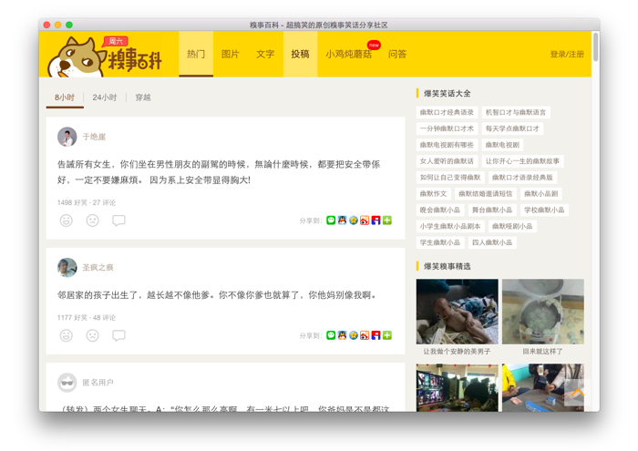

# ［糗事百科］桌面客户端




## 桌面端功能

- [x] 去广告
- [ ] 查看(妹子)头像大图
- [ ] 一键收藏至本地
- [ ] 夜间模式/暗色主题


## 个人背景

毕业前在糗百先后实习5个月，同事们很nice。  
不是糗百重度粉，关注不多，偶尔看看，发现笑料还是很足的。

深受 [caprine(Messenger)][1]、[electronic-wechat(微信)][2] 启发，当然还有我自己的[wxbot][3]，  
觉得糗百也可以有自己的一个桌面端。

基于electron，可开发出同时支持OSX/Linux/Windows的跨平台桌面应用。

糗事百科主站 ==> http://www.qiushibaike.com/


## 开发 & ~~测试~~ & ~~打包~~

```plain
$ npm install -g webpack
$ cd nixe
$ npm install
$ npm run dev
```

### Electron 中国镜像

```plain
ELECTRON_MIRROR=https://npm.taobao.org/mirrors/electron/
```


[1]: https://github.com/sindresorhus/caprine
[2]: https://github.com/geeeeeeeeek/electronic-wechat
[3]: https://github.com/fritx/wxbot
